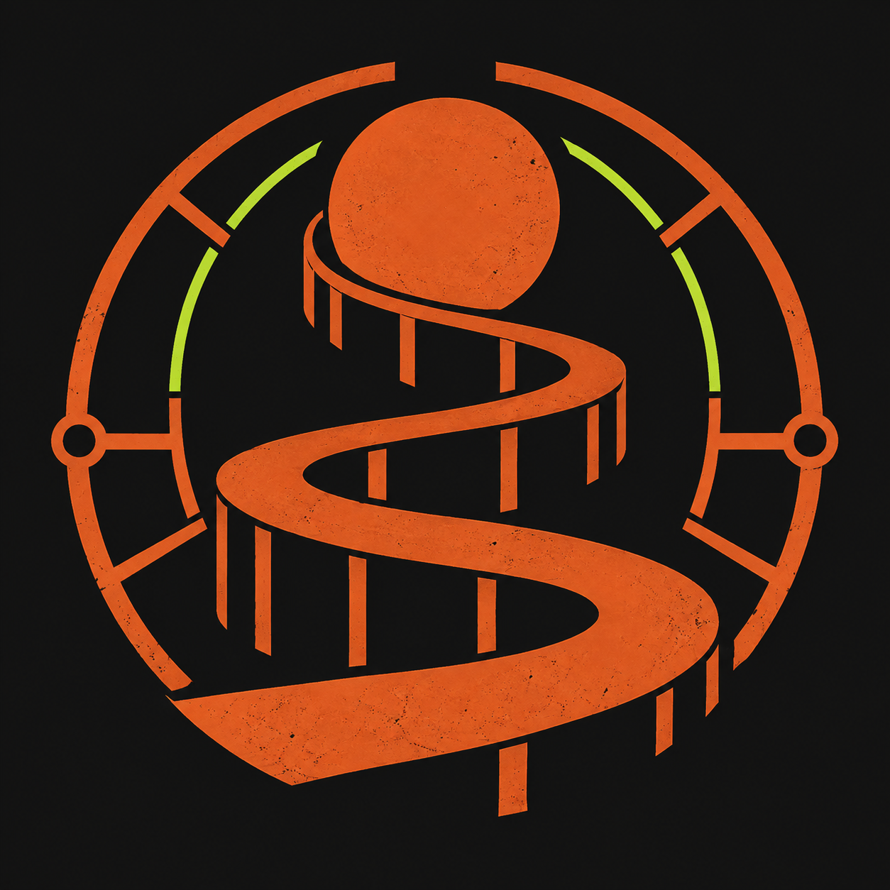

# ⛰️ Sisyphus

**Push once. Flux does the rest.**

Declarative infrastructure for a small, sharp, single-node Kubernetes cluster.

---

Sisyphus is the Git source of truth for a personal Kubernetes cluster running
on one schedulable Talos control-plane node at Netcup. Flux continuously turns
the desired state in this repository into the running platform: networking,
storage, access, applications, observability, and update automation.

## 🧭 At a glance

| Layer | What runs here |
| --- | --- |
| **Host** | Talos Linux on one schedulable control-plane node |
| **Orchestration** | Kubernetes with Flux and Kustomize |
| **Networking** | Cilium, Hubble Relay, and kube-proxy |
| **Public access** | Two outbound-only `cloudflared` replicas; no ingress controller or public origin ports |
| **Private access** | Tailscale Kubernetes Operator and a dedicated travel exit-node Connector |
| **Secrets** | SOPS-encrypted Kubernetes Secrets with age recipients |
| **Storage** | Rancher local-path at `/var/mnt/local-path`, `Retain`, node-local only |
| **Applications** | Kite, LiteLLM, and portfolio staging |
| **Data** | Dedicated PostgreSQL releases for Kite and LiteLLM, plus Redis for LiteLLM |
| **Observability** | Prometheus, Alertmanager, Grafana, Loki, Grafana Alloy, and Hubble |
| **Automation** | Renovate, GitHub Actions validation, and reviewed Flux image updates |

## 🔁 How changes reach the cluster

1. A change is proposed against `main` and checked by GitHub Actions.
2. After review and merge, Flux detects the new Git revision.
3. Flux decrypts SOPS resources in-cluster, resolves `dependsOn` ordering, and
   reconciles the declared state.
4. Renovate proposes ordinary dependency updates separately. Flux exclusively
   manages portfolio staging and Malg image revisions through
   `flux/portfolio-staging-image` and `flux/malg-image`, respectively; each
   branch opens a review pull request, and GitHub enables auto-merge for only
   those two branches after required checks pass. Other update pull requests
   remain manual and no branch deploys directly to `main`.

Normal Kubernetes resources belong in Git. Manual installation is reserved for
the documented Talos, Cilium, and Flux bootstrap boundary.

## 📚 Documentation

- [Bootstrap, recovery, and operations](docs/cluster-bootstrap.md)
- [Repository rules for contributors and agents](AGENTS.md)
- [Cluster reconciliation root](clusters/sisyphus/kustomization.yaml)
- [Infrastructure manifests](infrastructure/)

---

  Named after the king condemned to push the same rock forever—except this rock reconciles itself.

