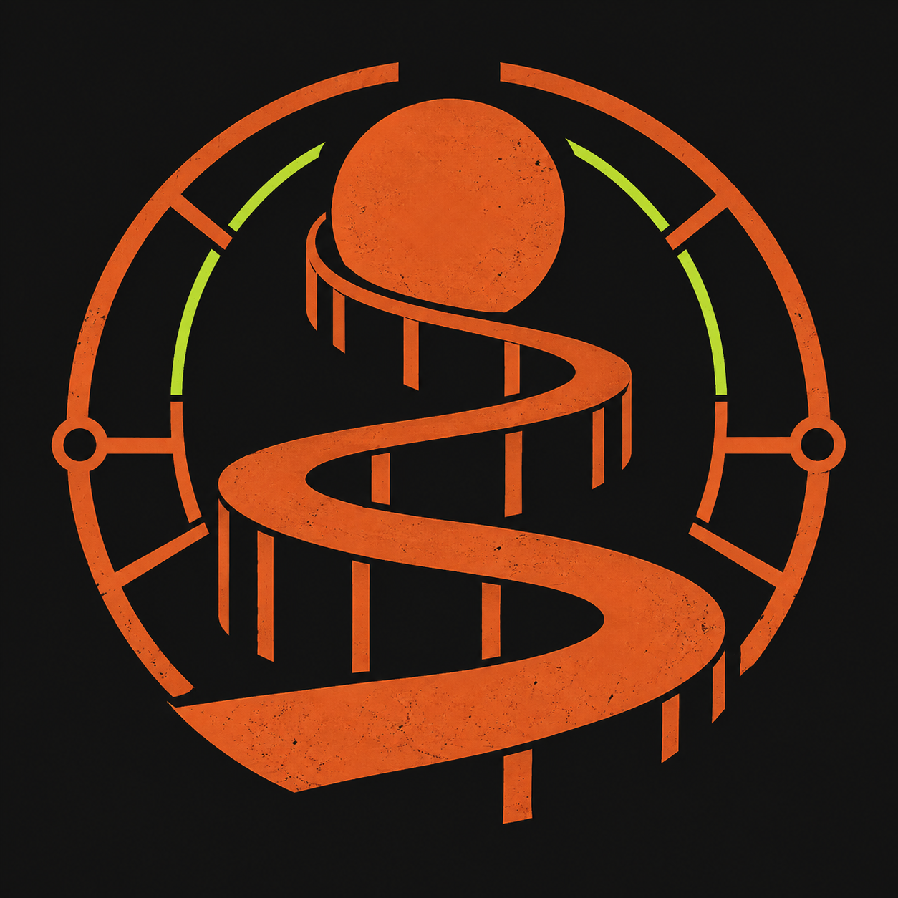

# ⛰️ Sisyphus

**Push once. Flux does the rest.**

Declarative infrastructure for a small, sharp, single-node Kubernetes cluster.

---

Sisyphus is the Git source of truth for a personal Kubernetes cluster running
on one schedulable Talos control-plane node at Netcup. Flux continuously turns
the desired state in this repository into the running platform: networking,
storage, access, applications, observability, and update automation.

## 🧭 At a glance

| Layer | What runs here |
| --- | --- |
| **Host** | Talos Linux on one schedulable control-plane node |
| **Orchestration** | Kubernetes with Flux and Kustomize |
| **Networking** | Cilium, Hubble Relay, and kube-proxy |
| **Public access** | Two outbound-only `cloudflared` replicas; no ingress controller or public origin ports |
| **Private access** | Tailscale Kubernetes Operator and a dedicated travel exit-node Connector |
| **Secrets** | SOPS-encrypted Kubernetes Secrets with age recipients |
| **Storage** | Rancher local-path at `/var/mnt/local-path`, `Retain`, node-local only |
| **Applications** | Kite, LiteLLM, and portfolio staging |
| **Data** | Dedicated PostgreSQL releases for Kite and LiteLLM, plus Redis for LiteLLM |
| **Observability** | Prometheus, Alertmanager, Grafana, Loki, Grafana Alloy, and Hubble |
| **Automation** | Renovate, GitHub Actions validation, and reviewed Flux image updates |

## 🔁 How changes reach the cluster

1. A change is proposed against `main` and checked by GitHub Actions.
2. After its required checks and merge, Flux detects the new Git revision.
3. Flux decrypts SOPS resources in-cluster, resolves `dependsOn` ordering, and
   reconciles the declared state.
4. Flux opens image PRs for portfolio staging, MALG, and Twenty. Their PRs use
   merge commits so reused branches retain their history. Renovate opens PRs
   for other application updates, including LiteLLM and cloudflared. Eligible
   application updates merge automatically after `static-checks`; platform,
   database, and major upgrades remain for review. No automation writes
   directly to `main`.

MALG publishes backend and frontend images as one semantic version, but Flux
does not use a release metadata file. The deployment checker requires both
repositories to use the same immutable tag, while each image keeps its own
digest. The migration Job runs `alembic upgrade head` from the image's bundled
Alembic graph; API and worker processes wait for that same schema before
starting. Migration and CRM schema Jobs retain their force annotations so a
new image reruns them. Runtime CRM contract compatibility checks remain active
during rolling updates.

Normal Kubernetes resources belong in Git. Manual installation is reserved for
the documented Talos, Cilium, and Flux bootstrap boundary.

## 📚 Documentation

- [Bootstrap, recovery, and operations](docs/cluster-bootstrap.md)
- [Repository rules for contributors and agents](AGENTS.md)
- [Cluster reconciliation root](clusters/sisyphus/kustomization.yaml)
- [Infrastructure manifests](infrastructure/)

---

  Named after the king condemned to push the same rock forever—except this rock reconciles itself.

